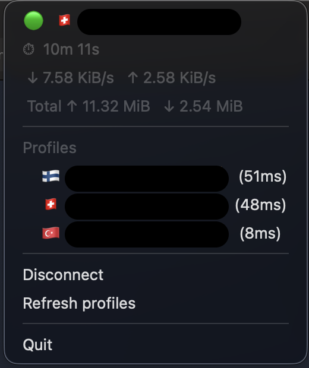

# xray-cli

XRay VPN client in Go.

**Features:**
- Auto-reconnect with exponential backoff (2 s → 60 s, capped, configurable attempt limit)
- Subscription URL support — fetch profiles from a remote base64-encoded subscription endpoint (compatible with v2rayNG, Shadowrocket, etc.)
- Multi-profile config support (`.yaml` with named profiles, subscription URL, or a plain `.txt` link file)
- macOS menu bar app (`--tray`) — country flag icon, live bandwidth, profile switching, server ping latency
- Server ping — TCP latency measurement for all profiles, shown inline in tray menu
- GeoIP country flags — automatic server location detection via ip-api.com, flag emoji as menu bar icon
- Profile refresh — re-fetch subscription profiles without restarting
- Remembers last profile — reconnects to the last-used profile on restart
- Server info panel — public IP, exit country, protocol, DNS server, IP leak detection (auto-refreshes every 60 s)
- DNS leak protection — `--dns` flag or `dns:` config overrides macOS DNS on connect, restored on disconnect
- Daemon + tray client split — root daemon for VPN, user-level tray for UI, communicate over HTTP
- HTTP status server — `/health` and `/status` (JSON metrics)

---

## Build

Go source lives in `./src`. Run `build.sh` from the repo root.

```bash
./build.sh                  # native: current OS + arch, CGO enabled
./build.sh --arch arm64     # native OS, arm64
./build.sh --arch amd64     # native OS, amd64
```

Output: `./dist/<os>/xray-cli-<arch>`

Requires Go 1.26+. `--tray` requires macOS with `CGO_ENABLED=1` (the default for native builds).

> `sudo` is required at **runtime** to create a TUN device.

---

## Usage

### Flags

| Flag | Default | Description |
|------|---------|-------------|
| `--link` | — | XRay connection link (`vless://…`, `vmess://…`, `trojan://…`, …) |
| `--config` | — | Config file: `.txt` (single link) or `.yaml` (multi-profile) |
| `--subscribe` | — | Subscription URL — fetches a base64-encoded list of proxy links |
| `--profile` | — | Named profile to use from a `.yaml` config or subscription |
| `--list-profiles` | `false` | Print available profiles and exit |
| `--dns` | `""` | Override DNS on connect (comma-separated, e.g. `1.1.1.1,8.8.8.8`). Routes DNS through VPN tunnel. |
| `--daemon-addr` | `""` | Run as daemon with HTTP control API; combine with `--tray` for client-only tray |
| `--status` | `""` | HTTP status server bind address, e.g. `127.0.0.1:9999` |
| `--verbose` | `false` | Log bandwidth stats every 10 s |
| `--log` | `info` | Log level: `debug` / `info` / `warn` / `error` |
| `--tray` | on for darwin | macOS menu bar app |
| `--tls-insecure` | `false` | Allow self-signed TLS certificates |
| `--max-reconnects` | `0` | Max reconnect attempts (0 = unlimited) |

### Direct link

```bash
sudo ./xray-cli --link "vless://..."
```

### Config file

`.yaml` config — multiple named profiles, optional subscription:
```yaml
subscription: "https://sub.example.com/token"  # optional remote profiles
default: home   # optional; falls back to the first entry if omitted
dns: [1.1.1.1, 8.8.8.8]  # optional: override DNS on connect (prevents DNS leak)

profiles:
  - name: home
    link: "vless://..."
  - name: work
    link: "vmess://..."
    tls_insecure: true
```
```bash
sudo ./xray-cli --config servers.yaml --profile work
sudo ./xray-cli --config servers.yaml --list-profiles
```

### Subscription URL

```bash
sudo ./xray-cli --subscribe "https://sub.example.com/token"
sudo ./xray-cli --subscribe "https://sub.example.com/token" --profile "US Server"
sudo ./xray-cli --subscribe "https://sub.example.com/token" --list-profiles
```

Inline profiles take priority over subscription profiles with the same name or link. If the subscription fetch fails but inline profiles exist, the client falls back to inline-only with a warning.

### macOS menu bar

```bash
sudo ./xray-cli --config servers.yaml --tray
```

The tray shows connection status with country flag icon, session duration, live bandwidth, server ping latency, and profile switching.



### Daemon + tray client (autostart with tray icon)

The `--daemon-addr` flag splits xray-cli into two cooperating processes:

| Process | Runs as | What it does |
|---------|---------|--------------|
| **Daemon** (LaunchDaemon) | root | Headless VPN + HTTP control API |
| **Tray client** (LaunchAgent) | user | Menu bar icon, polls daemon, sends commands |

```bash
# Terminal 1: daemon (root)
sudo xray-cli --config servers.yaml --daemon-addr 127.0.0.1:19099

# Terminal 2: tray client (no root needed)
xray-cli --tray --daemon-addr 127.0.0.1:19099
```

**Daemon API** (on `--daemon-addr`):
- `GET /health` — 200 / 503
- `GET /status` — JSON: connected, active_profile, bytes_in/out, reconnects
- `GET /profiles` — available profiles + which is active
- `GET /ping` — TCP latency + GeoIP country for each profile
- `GET /server-info` — public IP, exit country, protocol, DNS server, IP leak check
- `POST /connect` — `{"profile": "name"}` to switch
- `POST /disconnect` — stop VPN
- `POST /refresh` — re-fetch subscription profiles

**Install as launchd services:**

```bash
./build.sh
sudo ./setup-macos.sh install              # uses servers.yaml by default
sudo ./setup-macos.sh install myconfig.yaml  # or specify a config
```

This installs a LaunchDaemon (root, headless) and a LaunchAgent (user, tray icon). Both start on boot/login and auto-restart on crash.

```bash
sudo ./setup-macos.sh status     # check services and resource usage
sudo ./setup-macos.sh stop       # stop services
sudo ./setup-macos.sh start      # start services
sudo ./setup-macos.sh restart    # restart services
sudo ./setup-macos.sh uninstall  # remove everything
```

---

### DNS leak protection

By default, DNS queries go to your ISP's resolver even when VPN is active. The `--dns` flag (or `dns:` in YAML config) overrides macOS DNS settings on connect so queries route through the VPN tunnel:

```bash
sudo xray-cli --config servers.yaml --daemon-addr 127.0.0.1:19099 --dns 1.1.1.1,8.8.8.8
```

Or in config:
```yaml
dns: [1.1.1.1, 8.8.8.8]
```

The `--dns` flag takes precedence over the config file. Original DNS is restored on disconnect. The DNS cache is flushed on both transitions.

---

### Known limitation: unclean shutdown leaves routes behind

If the process is killed with `SIGKILL` (`kill -9`), route cleanup doesn't run. This is a fundamental OS limitation — `SIGKILL` cannot be caught by any process, so Go's signal handler never executes. If you see `add route: ... file exists` on the next start:

```bash
ps aux | grep xray-cli            # find and kill any stale instances
sudo route delete 0.0.0.0/1
sudo route delete 128.0.0.0/1
```
